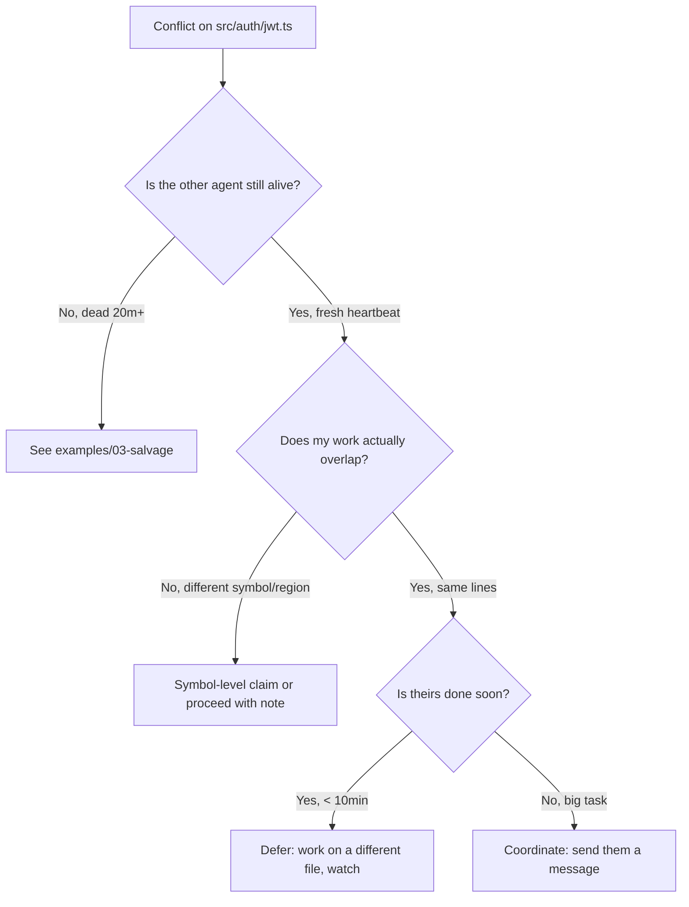

# 02 — Two Agents Want the Same File

**Scenario:** You ran `pd session files claim src/auth/jwt.ts` and it warned you that another agent already owns it.

```text
WARN: src/auth/jwt.ts claimed by agent abc-123
  identity: myapp:api:feature-y
  purpose:  "Rewrite jose imports"
  claimed:  4 minutes ago
```

PD's claims are **advisory**. The daemon will not block you. The decision — proceed, defer, or talk — is yours.

## Decision tree



## Path E — non-overlapping work in the same file

If you're editing `parseToken` and they're editing `signToken`, you can share the file safely:

```bash
# Optional: claim at symbol level (requires the symbol-index feature)
pd session files claim src/auth/jwt.ts --symbol parseToken --start-line 80 --end-line 140

# Drop a note so the other agent sees you in their next sitrep
pd note --type intent "Touching src/auth/jwt.ts:parseToken — no overlap with refresh logic"
```

## Path G — defer

```bash
# Watch their channel; resume when they ship
pd watch myapp:fleet:committed --exec "pd note 'Resuming jwt.ts work'"

# Pick up adjacent work meanwhile
pd note --type intent "Deferring jwt.ts; switching to refresh.ts"
```

## Path H — talk to them

```bash
# Direct inbox message
pd inbox send abc-123 "Need to share src/auth/jwt.ts — I'm rewriting parseToken. ETA your work?"

# Or via a coordination channel
pd pub coordination:inconsistency "Two agents in src/auth/jwt.ts: abc-123 (jose imports), me (parseToken refactor). Proposing: I wait, ship together."
```

`coordination:inconsistency` is the conventional channel for "humans, look at this." The operator will see it on the dashboard.

## What you must NOT do

- **Don't bypass with `--force`.** PD won't stop you, but the next `pd sitrep` will show two agents in the same file and one of you will lose work at merge time.
- **Don't release their claim.** You can only release your own.
- **Don't kill their agent process** because their claim is in your way. Send a message.

## After the conflict resolves

```bash
pd note --type decision "Coordinated with abc-123 on jwt.ts. They shipped jose imports first; I rebased and finished parseToken refactor."
```

The note is the audit trail. Future-you, future-them, and the human reviewing the PR will all see it.
