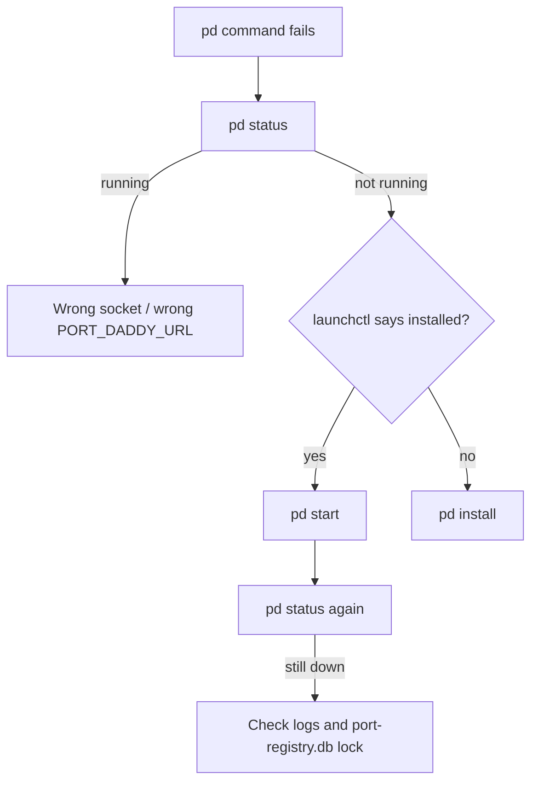

# 06 — Debug: Daemon Down

**Scenario:** `pd <anything>` returns `Connection refused` or hangs.

## Triage tree



## Step 1: confirm daemon state

```bash
pd status                                    # canonical
launchctl list | grep portdaddy              # macOS launchd registration
ls -la ~/.port-daddy/daemon.{sock,pid,port}  # runtime files
```

Possible states:

| Output | Meaning | Fix |
|---|---|---|
| `running` | Daemon is up. Your CLI is hitting the wrong endpoint. | Unset `PORT_DADDY_URL`. Check `PORT_DADDY_SOCK`. |
| `not running` + plist registered | launchd loaded but process died. | `pd start` (or `launchctl kickstart -k gui/$(id -u)/com.portdaddy.daemon`). |
| `not running` + plist not registered | Never installed (or got removed). | `pd install`. |
| Hang on `pd status` | Socket exists but daemon is wedged. | See Step 3. |

## Step 2: read the logs

```bash
tail -n 200 ~/.port-daddy/daemon.log         # primary log
tail -n 50 ~/.port-daddy/launchd.{out,err}.log  # launchd's stdout/stderr capture
```

Common patterns:

- `EADDRINUSE` on the TCP fallback port — another process has 9876. Set `PORT_DADDY_PORT` and restart.
- `database is locked` — another process held the SQLite DB. See Step 3.
- `master.key permissions are 0644, expected 0600` — the daemon refuses to boot. `chmod 600 ~/.port-daddy/master.key`.

## Step 3: if the daemon is wedged

```bash
# Find the PID
cat ~/.port-daddy/daemon.pid

# Confirm it's actually that process
ps -p "$(cat ~/.port-daddy/daemon.pid)"

# Hard kill (only if it's wedged)
kill -9 "$(cat ~/.port-daddy/daemon.pid)"

# Stale socket cleanup
rm -f ~/.port-daddy/daemon.sock ~/.port-daddy/daemon.ipc

# Restart
pd start
```

## Step 4: SQLite locked

If logs show `SQLITE_BUSY` or `database is locked`:

```bash
# Find anyone touching the DB
lsof ~/coding/port-daddy/port-registry.db

# Kill the squatter, then check integrity
sqlite3 ~/coding/port-daddy/port-registry.db "PRAGMA integrity_check;"
# Expect: ok
```

If `integrity_check` fails: the DB is corrupted. The daemon will refuse to boot. Restore from your backup or — if you have none — back up the file, delete it, restart. You'll lose history. Notes are encrypted on disk, so they're useless without the master key anyway.

## Step 5: still broken — escalate

```bash
pd version                                   # if this works, the daemon is up
curl -v --unix-socket ~/.port-daddy/daemon.sock http://localhost/ping

# Drop a feedback file (this is dogfooding, after all)
cat > .spark/feedback/$(date +%Y-%m-%d)-daemon-wedge.md <<EOF
Surface: daemon
Severity: blocker
What happened: pd status hangs forever; daemon.pid points to a live PID but no response on socket.
Why it matters: blocks every coordination call.
Suggested direction: investigate event-loop block / unbounded queue.
EOF
```

## Things this doc is NOT for

- "I claimed a port and it's a different number than expected." → That's correct behavior. See SKILL.md "Common Issues."
- "Fleet didn't fire on my commit." → See `examples/04-fleet-from-zero.md` and check `fleet.name == basename(projectDir)`.
- "MCP tool not found in Claude Code." → That's an MCP wiring issue, not a daemon-down issue. Check `pd mcp install`.
