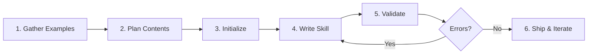

# Skill Architect: The Authoritative Meta-Skill

The unified authority for creating expert-level Agent Skills. Encodes the knowledge that separates a skill that *merely exists* from one that *activates precisely, teaches efficiently, and makes users productive immediately*.

## Philosophy

**Great skills are progressive disclosure machines.** They encode real domain expertise (shibboleths), not surface instructions. They follow a three-layer architecture: lightweight metadata for discovery, lean SKILL.md for core process, and reference files for deep dives loaded only on demand.

---

## When to Use This Skill

- Creating new skills from scratch or from existing expertise
- Auditing/reviewing skills for quality, activation, and progressive disclosure
- Improving activation rates and reducing false positives
- Encoding domain expertise (shibboleths, anti-patterns, temporal knowledge)
- Designing skills that subagents consume effectively
- Building self-contained tools (scripts, MCPs, subagents)
- Debugging why skills don't activate or activate incorrectly

**NOT for**: General Claude Code features (slash commands, MCP server implementation), non-skill coding advice or code review, debugging runtime errors (use domain-specific skills), template generation without real domain expertise to encode.

---

## Quick Wins (Immediate Improvements)

For existing skills, apply in priority order:

1. **Tighten description** -- Follow `[What] [When to use]. NOT for [Exclusions]` formula
2. **Check line count** -- SKILL.md must be &lt;500 lines; move depth to `/references`
3. **Add NOT clause** -- Prevent false activation with explicit exclusions
4. **Add 1-2 anti-patterns** -- Use shibboleth template (Novice/Expert/Timeline)
5. **Remove dead files** -- Delete unreferenced files in `scripts/` and `references/` (no phantoms)
6. **Test activation** -- Write 5 queries that should trigger and 5 that shouldn't

---

## Progressive Disclosure Architecture

Skills use three-layer loading. The runtime scans metadata at startup, loads SKILL.md on activation, and pulls reference files *only when the agent decides it needs them*.

| Layer | Content | Size | Loading |
|-------|---------|------|---------|
| 1. Metadata | `name` + `description` in frontmatter | ~100 tokens | Always in context (catalog scan) |
| 2. SKILL.md | Core process, decision trees, brief anti-patterns | &lt;5k tokens | On skill activation |
| 3. References | Deep dives, examples, templates, specs | Unlimited | On-demand, per-file, only when relevant |

**Critical rules**:
- Keep SKILL.md under 500 lines. Move depth to `/references`.
- Reference files are NOT auto-loaded. Only SKILL.md enters context on activation.
- In SKILL.md, list each reference file with a 1-line description of when to consult it.
- Never instruct "read all reference files before starting." Instead: "Read only the files relevant to the current step."

---

## Frontmatter Rules

### Required Fields

| Key | Purpose | Constraints |
|-----|---------|-------------|
| `name` | Lowercase-hyphenated identifier | Max 64 chars, a-z/0-9/hyphens only, no "anthropic" or "claude", no XML tags |
| `description` | Activation trigger: `[What] [When to use]. NOT for [Exclusions]` | Max 1024 chars, no XML tags. See Description Formula |

### Optional Fields

| Key | Purpose | Example |
|-----|---------|---------|
| `allowed-tools` | Comma-separated tool names (least privilege) | `Read,Write,Grep` |
| `argument-hint` | Hint shown in autocomplete for expected arguments | `"[path] [format]"` |
| `license` | License identifier | `MIT` |
| `disable-model-invocation` | If `true`, only user-triggered via `/skill-name` | `true` |
| `user-invocable` | Controls whether skill appears in UI menus | `true` |
| `context` | Execution context; `fork` runs skill in isolated subagent | `fork` |
| `agent` | Which subagent type when `context: fork` | `code-reviewer` |
| `model` | Override model when skill is active | `sonnet` |
| `hooks` | Hooks scoped to this skill's lifecycle | See hooks reference |
| `metadata` | Arbitrary key-value map for tooling/dashboards | `author: your-org` |

### Custom Keys (Safe to Use)

Custom keys like `category`, `tags`, `version` are **ignored by Claude Code** but safe to include for your own tooling (gallery websites, documentation generators, dashboards). Place them inside the `metadata:` block to keep them organized and avoid confusion with real runtime keys.

### Invalid Keys (Confusingly Similar to Valid Ones)

```yaml
# These look like valid keys but aren't -- use the correct alternatives
tools: Read,Write           # Use 'allowed-tools' instead
integrates_with: [...]      # Use SKILL.md body text instead
outputs: [...]              # Use SKILL.md Output Format section instead
dependencies: [...]         # Use SKILL.md body text (not a real frontmatter key)
bundled-resources: [...]    # Use SKILL.md body text (not a real frontmatter key)
```

**Common mistakes that prevent loading**: `tools:` instead of `allowed-tools:` (silently ignored), YAML list syntax `[Read, Write]` in allowed-tools (use comma-separated string), name with spaces/uppercase (use lowercase-hyphenated), name not matching directory name (causes activation mismatch). Run `python scripts/validate_skill.py <path>` to catch all of these.

**Platform constraints** (name: 64 chars, description: 1024 chars, upload: 8MB, 8 skills/request max, no XML tags): See `references/claude-extension-taxonomy.md` for full details. Skills do NOT sync across Claude.ai, Claude API, and Claude Code -- maintain Git as single source of truth.

---

## Description Formula

**Pattern**: `[What it does] [When to use -- be slightly pushy]. NOT for [Exclusions].`

The description is the most important line for activation. Claude's runtime scans descriptions to decide which skill to load. Claude evaluates descriptions **semantically**, not via keyword matching. It reasons about whether your description covers the user's intent. Claude also tends to **undertrigger** -- make descriptions slightly pushy to combat this.

| Problem | Bad | Good |
|---------|-----|------|
| Too vague | "Helps with images" | "CLIP semantic search for image-text matching and zero-shot classification. NOT for counting, spatial reasoning, or generation." |
| No exclusions | "Reviews code changes" | "Reviews TypeScript/React diffs and PRs for correctness. NOT for writing new features." |
| Catch-all | "Helps with product management" | "Writes and refines product requirement documents (PRDs). NOT for strategy decks." |

**Full guide with more examples**: See `references/description-guide.md`

---

## SKILL.md Template

```markdown
---
name: your-skill-name
description: [What it does] [When to use -- be slightly pushy]. NOT for [Exclusions].
allowed-tools: Read,Write
---

# Skill Name
[One sentence purpose]

## When to Use
Use for: [A, B, C with specific trigger keywords]
NOT for: [D, E, F -- explicit boundaries]

## Core Process
[Mermaid diagrams for decisions/flows. See visual-artifacts.md for catalog]

## Anti-Patterns
### [Pattern Name]
**Novice**: [Wrong assumption]
**Expert**: [Why it's wrong + correct approach]
**Timeline**: [When this changed, if temporal]

## References
- `references/guide.md` -- Consult when [specific situation]
- `references/examples.md` -- Consult for [worked examples of X]
```

---

## The 6-Step Skill Creation Process



### Step 1: Gather Concrete Examples

Collect 3-5 real queries that should trigger this skill, and 3-5 that should NOT.

### Step 2: Plan Reusable Contents

Identify scripts, references, assets that prevent re-work. Also identify shibboleths: domain algorithms, temporal knowledge, framework evolution, common pitfalls.

### Step 3: Initialize

```bash
scripts/init_skill.py <skill-name> --path <output-directory>
```

### Step 4: Write the Skill

Order: **Scripts first** (working code) -> **References next** (domain knowledge) -> **SKILL.md last** (core process, reference index).

Write in imperative form: "To accomplish X, do Y" not "You should do X."

### Step 5: Validate

```bash
python scripts/validate_skill.py <path>
python scripts/check_self_contained.py <path>
```

Fix ERRORS then WARNINGS then SUGGESTIONS.

### Step 6: Iterate

After real-world use: notice struggles, improve SKILL.md and resources, update CHANGELOG.md.

---

## Designing Skills for Subagent Consumption

### Three Skill-Loading Layers

1. **Preloaded** (2-5 core skills): Injected into the subagent's system context.
2. **Dynamically selected**: Subagent receives a catalog (name + 1-line description) and picks 1-3 matching skills.
3. **Execution-time**: Subagent reads each skill's "When to use" section, follows numbered steps, respects output contracts, runs QA checks.

### Subagent Prompt Structure

Four sections: **Identity** (narrow role), **Skill usage rules** (skills as standard operating procedures), **Task loop** (restate, select skills, plan, execute, validate, return), **Constraints** (quality bar, safety, tie-breaking).

**Full templates and orchestration patterns**: See `references/subagent-design.md`

---

## Visual Artifacts: Mermaid Diagrams

**For humans**, diagrams render as visual flowcharts, state machines, and timelines. **For agents**, Mermaid is a text-based graph DSL -- `A -->|Yes| B` is an explicit, unambiguous edge. Both audiences benefit.

**Rule**: If a skill describes a process, decision tree, architecture, state machine, or data relationship, include a Mermaid diagram.

| Skill Content | Diagram Type | Syntax |
|---------------|-------------|--------|
| Decision trees / troubleshooting | Flowchart | `flowchart TD` |
| API/agent communication protocols | Sequence | `sequenceDiagram` |
| Lifecycle / status transitions | State | `stateDiagram-v2` |
| Temporal knowledge / evolution | Timeline | `timeline` |
| Data models / schemas | ER | `erDiagram` |
| Domain taxonomy / concept maps | Mindmap | `mindmap` |
| Priority matrices (2-axis) | Quadrant | `quadrantChart` |
| Infrastructure / cloud topology | Architecture | `architecture-beta` |

**Full catalog (all 23 types) with syntax, examples, and YAML config**: See `references/visual-artifacts.md`

---

## Encoding Shibboleths

Expert knowledge that separates novices from experts. Things LLMs get wrong due to outdated training data or cargo-culted patterns.

### Shibboleth Template

```markdown
### Anti-Pattern: [Name]
**Novice**: "[Wrong assumption]"
**Expert**: [Why it's wrong, with evidence]
**Timeline**: [Date]: [Old way] -> [Date]: [New way]
**LLM mistake**: [Why LLMs suggest the old pattern]
**Detection**: [How to spot this in code/config]
```

**Full catalog with case studies**: See `references/antipatterns.md`

---

## Self-Contained Tools and the Extension Taxonomy

Skills are one of seven Claude extension types. Most skills should include scripts. MCPs are only for auth/state boundaries. Plugins are for sharing skills across teams/community.

| Need | Extension Type | Key Requirement |
|------|---------------|-----------------|
| Domain expertise / process | **Skill** (SKILL.md) | Decision trees, anti-patterns, output contracts |
| Packaging & distribution | **Plugin** (plugin.json) | Bundles skills + hooks + MCP + agents |
| External API + auth | **MCP Server** | Working server + setup README |
| Repeatable local operation | **Script** | Actually runs (not a template), minimal deps |
| Multi-step orchestration | **Subagent** | 4-section prompt, skills, workflow |
| User-triggered action | **Slash Command** | Skill with `user-invocable: true` |
| Lifecycle automation | **Hook** | 17+ events: PreToolUse, PostToolUse, Stop, etc. |
| Programmatic access | **Agent SDK** | npm/pip package, CI/CD pipelines |

**Full taxonomy with examples and common mistakes**: See `references/claude-extension-taxonomy.md`
**Detailed tool patterns**: See `references/self-contained-tools.md`
**Plugin creation and distribution**: See `references/plugin-architecture.md`

---

## Tool Permissions (Least Privilege)

| Access Level | `allowed-tools` |
|-------------|-----------------|
| Read-only | `Read,Grep,Glob` |
| File modifier | `Read,Write,Edit` |
| Build integration | `Read,Write,Bash(npm:*,git:*)` |
| Never for untrusted | Unrestricted `Bash` |

---

## Anti-Pattern Summary

| # | Anti-Pattern | Fix |
|---|-------------|-----|
| 1 | Documentation Dump | Decision trees in SKILL.md, depth in `/references` |
| 2 | Missing NOT clause | Always include "NOT for X, Y, Z" in description |
| 3 | Phantom Tools | Only reference files that exist and work |
| 4 | Template Soup | Ship working code or nothing |
| 5 | Overly Permissive Tools | Least privilege: specific tool list, scoped Bash |
| 6 | Stale Temporal Knowledge | Date all advice, update quarterly |
| 7 | Catch-All Skill | Split by expertise type, not domain |
| 8 | Vague Description | Use `[What] [When to use]. NOT for [Exclusions]` |
| 9 | Eager Loading | Never "read all files first"; lazy-load references |
| 10 | Prose-Only Processes | Use Mermaid diagrams for decisions, workflows, architectures |

**Full case studies**: See `references/antipatterns.md`

---

## Validation Checklist

```
[ ] SKILL.md exists and is &lt;500 lines
[ ] Frontmatter has name + description (minimum required)
[ ] Description follows [What][When to use] NOT [Exclusions] formula
[ ] Description is specific and context-rich (semantic activation, not keyword lists)
[ ] Name and description are aligned (not contradictory)
[ ] At least 1 anti-pattern with shibboleth template
[ ] All referenced files actually exist (no phantoms)
[ ] Scripts work (not templates), have clear CLI, handle errors
[ ] Reference files each have a 1-line purpose in SKILL.md
[ ] Processes/decisions/lifecycles use Mermaid diagrams, not prose
[ ] CHANGELOG.md tracks version history
[ ] If subagent-consumed: output contracts are defined
[ ] Skill passes its own validation tools (meta-consistency)
```

Run automated checks: `python scripts/validate_skill.py <path>` and `python scripts/validate_mermaid.py <path>`

---

## Success Metrics

| Metric | Target |
|--------|--------|
| Correct activation | &gt;90% |
| False positive rate | &lt;5% |
| Token usage | &lt;5k tokens |
| Time to productive | &lt;5 min |

---

## Reference Files

Consult these for deep dives -- they are NOT loaded by default:

| File | Consult When |
|------|-------------|
| `references/knowledge-engineering.md` | KE methods for extracting expert knowledge into skills |
| `references/description-guide.md` | Writing or rewriting a skill description |
| `references/antipatterns.md` | Looking for shibboleths, case studies, or temporal patterns |
| `references/self-contained-tools.md` | Adding scripts, MCP servers, or subagents to a skill |
| `references/subagent-design.md` | Designing skills for subagent consumption or orchestration |
| `references/claude-extension-taxonomy.md` | Skills vs Plugins vs MCPs vs Hooks vs Agent SDK |
| `references/plugin-architecture.md` | Creating, packaging, and distributing plugins |
| `references/visual-artifacts.md` | Adding Mermaid diagrams: all 23 types, YAML config |
| `references/mcp-template.md` | Building an MCP server for a skill |
| `references/subagent-template.md` | Defining subagent prompts and multi-agent pipelines |
| `references/scoring-rubric.md` | Quantitative skill evaluation (0-10 scoring criteria) |
| `references/skill-composition.md` | Cross-skill dependencies and composition patterns |
| `references/skill-lifecycle.md` | Maintenance, versioning, and deprecation guidance |
| `references/activation-debugging.md` | Diagnosing why skills don't activate or false-positive |
| `agents/cross-evaluator.md` | Template for cross-evaluating skills |
