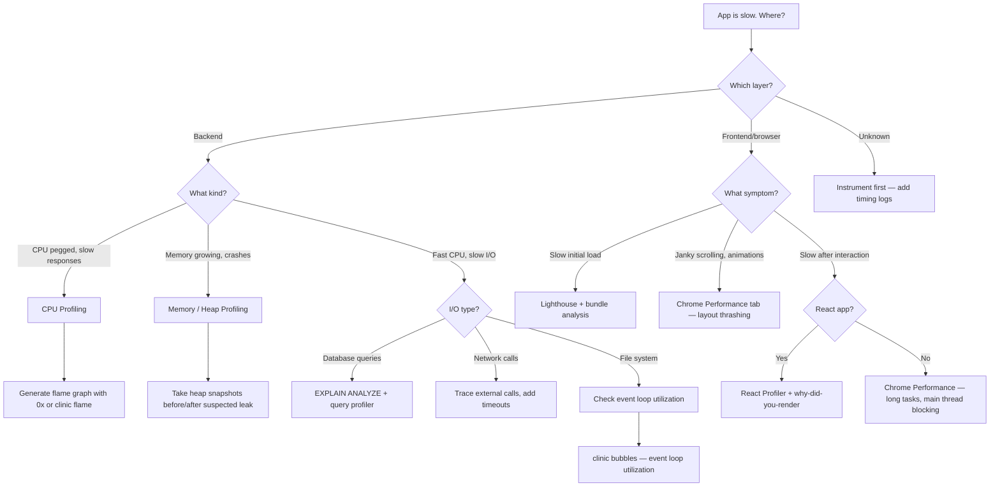

# Performance Profiling

Find where your application actually spends time before touching a line of code. Covers the full stack: Node.js CPU and memory profiling, browser flame graphs, React render profiling, and database query analysis. The discipline here is profile first, optimize second — premature optimization is not a workflow, it is a guess.

## When to Use

**Use for**:
- Diagnosing slow Node.js applications (CPU-bound, I/O-bound, memory pressure)
- Generating and reading flame graphs to find hot code paths
- Detecting memory leaks via heap snapshots and growth trends
- Profiling React component render performance with React Profiler
- Measuring browser rendering performance (Core Web Vitals, layout thrashing, long tasks)
- Database query profiling with EXPLAIN ANALYZE
- Measuring event loop utilization and latency

**NOT for**:
- Infrastructure monitoring, distributed tracing, or log aggregation (use `logging-observability`)
- Load testing and capacity planning (a separate domain)
- Network latency analysis between services (use distributed tracing tools)
- Database schema design optimization (separate from query profiling)

---

## Core Decision: Where Is My App Slow?



---

## Node.js: CPU Profiling

### V8 Inspector (Built-in)

```bash
# Attach inspector and capture a CPU profile
node --inspect src/index.js

# Or start paused and wait for DevTools
node --inspect-brk src/index.js
```

Then open `chrome://inspect` in Chrome, click the target, go to the **Profiler** tab, and record while sending load to the server.

### 0x: Flame Graphs from the Terminal

```bash
npm install -g 0x

# Profile a script (runs it, generates flame graph)
0x -- node src/index.js

# Profile with a load generator running simultaneously
0x -- node src/server.js &
npx autocannon -d 30 http://localhost:3000/api/heavy
```

0x generates an interactive HTML flame graph. The **widest stacks** are where time is spent. Look for:
- Functions that appear wide near the bottom (called frequently by everything)
- Unexpected width in library code (serialization, template engines, parsers)
- Idle / `[idle]` blocks — I/O wait, not CPU (look elsewhere for those)

### Clinic.js Suite

```bash
npm install -g clinic

# Doctor: overview of what is wrong
clinic doctor -- node src/server.js

# Flame: CPU flame graph (wraps 0x)
clinic flame -- node src/server.js

# Bubbles: event loop utilization
clinic bubbles -- node src/server.js
```

Clinic Doctor gives you a triage view: CPU, memory, event loop, and handles. Start here when you do not know what kind of bottleneck you have.

### Event Loop Utilization (ELU)

```js
const { performance } = require('perf_hooks');

// Sample ELU every 5 seconds
let last = performance.eventLoopUtilization();
setInterval(() => {
  const current = performance.eventLoopUtilization();
  const diff = performance.eventLoopUtilization(current, last);
  console.log(`ELU: ${(diff.utilization * 100).toFixed(1)}%`);
  last = current;
}, 5000);
```

ELU above 80% means the event loop is saturated — CPU-bound work or sync blocking. ELU near 0% with slow responses means I/O wait (network, disk, database).

---

## Node.js: Memory Profiling

### Heap Snapshots

```bash
# Take heap snapshot via CLI
node --inspect src/index.js
# In chrome://inspect → Memory tab → Take Heap Snapshot
```

**Three-snapshot technique for leak detection**:
1. Snapshot after startup (baseline)
2. Snapshot after N requests (warm)
3. Snapshot after 2N requests (growth)

Compare Snapshot 3 to Snapshot 2 — objects that grew proportionally to request count are leaking.

### Common Leak Patterns

**Closure captures** — Variables captured in long-lived closures that should have been released:

```js
// LEAK: handler is registered but never removed
emitter.on('data', (chunk) => {
  processedData.push(chunk);  // processedData grows unbounded
});

// FIX: remove listener when done, or use once()
emitter.once('data', handler);
// or
const handler = (chunk) => { ... };
emitter.on('data', handler);
// later:
emitter.off('data', handler);
```

**Growing caches without eviction**:

```js
// LEAK: cache grows forever
const cache = new Map();
app.get('/user/:id', async (req, res) => {
  if (!cache.has(req.params.id)) {
    cache.set(req.params.id, await db.getUser(req.params.id));
  }
  res.json(cache.get(req.params.id));
});

// FIX: use LRU cache with max size
const LRU = require('lru-cache');
const cache = new LRU({ max: 1000, ttl: 1000 * 60 * 5 });
```

**WeakRef and FinalizationRegistry** (for intentional weak references):

```js
const cache = new Map();

function cacheValue(key, obj) {
  const ref = new WeakRef(obj);
  const registry = new FinalizationRegistry((k) => cache.delete(k));
  registry.register(obj, key);
  cache.set(key, ref);
}
```

---

## Anti-Pattern: Optimizing Without Profiling

**Novice**: "This function looks expensive, I'll rewrite it in a more efficient algorithm."

**Expert**: Rewrote the wrong function. Profiling would have shown that this function is called once per startup and contributes 0.1% of runtime. The actual bottleneck was JSON serialization in the response handler, called 10,000 times per second. Optimization effort must follow measurement, never intuition.

**Detection**: The "optimized" code is measurably faster in microbenchmark isolation but production p99 latency is unchanged.

---

## Anti-Pattern: Micro-Benchmarking in Isolation

**Novice**: Writes a benchmark comparing two sorting algorithms on an array of 1000 items, concludes Algorithm B is 2x faster, rewrites production code.

**Expert**: Micro-benchmarks measure JIT-compiled hot paths under artificial conditions. Real workloads have different data shapes, mixed call patterns, GC pressure, and I/O interspersed. The JIT may optimize the benchmark differently than the real call site. Profile the actual application under real load — or at minimum, profile with realistic data shapes and call patterns embedded in the actual application code path.

**The test**: Does your benchmark run in a tight loop 10,000 times before measuring? If yes, V8 has JIT-compiled it differently than it will compile the real code, which runs cold at startup and is called with varied inputs.

---

## React Rendering Performance

### React Profiler (DevTools)

1. Open React DevTools → Profiler tab
2. Click "Record"
3. Perform the slow interaction
4. Stop recording
5. Examine the flame chart — bars represent components, width represents render time

Key columns: **"Why did this render?"** shows which prop or state change triggered each render.

### why-did-you-render

```bash
npm install @welldone-software/why-did-you-render
```

```js
// src/wdyr.js (import before React)
import React from 'react';
if (process.env.NODE_ENV === 'development') {
  const whyDidYouRender = require('@welldone-software/why-did-you-render');
  whyDidYouRender(React, { trackAllPureComponents: true });
}
```

```js
// Mark a specific component for tracking
MyExpensiveComponent.whyDidYouRender = true;
```

This logs to the console every time a component re-renders with the same props — exposing unnecessary renders caused by reference equality failures.

### Common React Performance Patterns

```js
// Memoize expensive components
const ExpensiveList = React.memo(({ items, onSelect }) => {
  return items.map(item => <Item key={item.id} item={item} onSelect={onSelect} />);
});

// Stable callback references — prevent re-renders downstream
const handleSelect = useCallback((id) => {
  setSelected(id);
}, []); // no deps: stable forever

// Memoize expensive computations
const sortedItems = useMemo(() => {
  return [...items].sort((a, b) => a.name.localeCompare(b.name));
}, [items]);

// Virtualize long lists
import { FixedSizeList } from 'react-window';
<FixedSizeList height={600} itemCount={items.length} itemSize={50} width="100%">
  {({ index, style }) => <Row item={items[index]} style={style} />}
</FixedSizeList>
```

---

## Database Query Profiling

### PostgreSQL EXPLAIN ANALYZE

```sql
-- Wrap any query in EXPLAIN (ANALYZE, BUFFERS) to see execution plan
EXPLAIN (ANALYZE, BUFFERS, FORMAT TEXT)
SELECT u.*, COUNT(o.id) as order_count
FROM users u
LEFT JOIN orders o ON o.user_id = u.id
WHERE u.created_at > NOW() - INTERVAL '30 days'
GROUP BY u.id;
```

Read the output bottom-up. Each node shows:
- `actual time=X..Y` — startup time to first row, total time for all rows
- `rows=N` — actual rows returned
- `loops=N` — how many times this node executed

**Red flags**:
- `Seq Scan` on large tables — missing index
- `rows=1000` estimated vs `rows=1` actual — stale statistics, run `ANALYZE`
- `Hash Join` with large hash batches — memory pressure, tune `work_mem`
- `Nested Loop` on large outer result — cartesian product risk

### Finding Slow Queries in Production

```sql
-- Enable pg_stat_statements extension
CREATE EXTENSION IF NOT EXISTS pg_stat_statements;

-- Top 10 slowest queries by total time
SELECT
  query,
  calls,
  total_exec_time / 1000 AS total_seconds,
  mean_exec_time AS mean_ms,
  rows
FROM pg_stat_statements
ORDER BY total_exec_time DESC
LIMIT 10;
```

---

## Browser Profiling

See `references/browser-profiling.md` for the full Chrome Performance tab workflow, Core Web Vitals measurement, and layout thrashing diagnosis.

---

## TODO(human)

Implement the bottleneck classifier below. This should analyze profiling data from multiple sources and synthesize a ranked list of bottlenecks with improvement estimates.

```
function classifyBottleneck(profilingData) {
  // TODO(human): Implement bottleneck classification
  // Input: {
  //   cpuProfile?: { hotFunctions: [{name, selfTime, totalTime}] },
  //   heapSnapshots?: { growthRate: number, suspects: string[] },
  //   elu?: number,                    // 0-1, event loop utilization
  //   dbSlowQueries?: [{query, ms}],
  //   reactProfiler?: { slowComponents: [{name, renderTime}] }
  // }
  // Output: {
  //   bottlenecks: [{
  //     type: 'cpu' | 'memory' | 'io' | 'database' | 'rendering',
  //     description: string,
  //     severity: 'critical' | 'high' | 'medium',
  //     estimatedImpact: string,
  //     nextStep: string
  //   }]
  // }
  //
  // Consider: ELU < 0.2 with slow responses means I/O, not CPU
  // Consider: Heap growth rate vs request rate — is it proportional?
  // Consider: DB queries are often the dominant factor — weight them high
}
```

---

## References

- `references/node-profiling.md` — Consult for detailed Node.js profiling: --inspect flags, clinic.js commands, heap snapshot analysis, event loop monitoring, stream backpressure diagnosis
- `references/browser-profiling.md` — Consult for browser performance: Chrome Performance tab workflow, Lighthouse CI integration, React Profiler deep-dive, Core Web Vitals measurement, layout thrashing patterns
